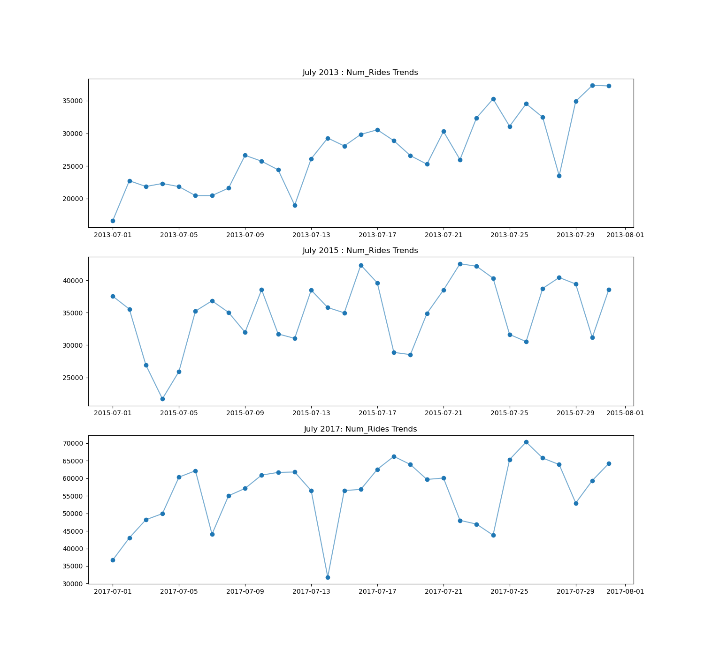
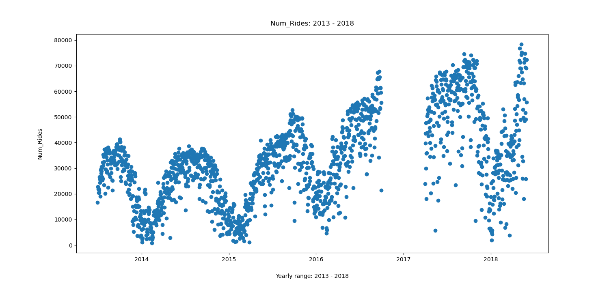
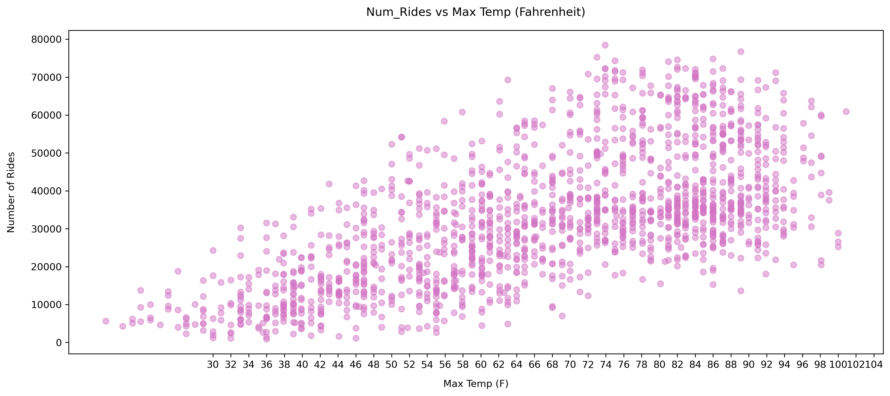

--- 
title:  "Citibike Ridership Dashboard"
excerpt:  "Interactive Streamlit dashboard predicting NYC Citibike ridership from weather data, with a linear regression model achieving R² of 0.67"
permalink:  "/projects/citibike/"
---

### Live app: [Citibike Ridership Streamlit App](https://citibike-ridership.streamlit.app)  
### Github Repo: [View on GitHub](https://github.com/ALINATSUI/Citibike_Ridership) 

#### <u>**Project Goal**</u>

Analyzes the relationship between daily NYC weather conditions and Citibike ridership trends (2013–2018) to build a predictive linear regression model and an interactive web application, using public Citibike and NOAA datasets hosted on Google BigQuery.  

#### <u>**Individual Contribution**</u>
End-to-end ownership: data ingestion, modeling, frontend UI, and cloud deployment automation.  

Data pipeline: Wrote SQL to extract and join public Citibike and NOAA weather datasets from BigQuery, cleaned/preprocessed the data in pandas, and engineered calendar and weather features  

Modeling: Trained and evaluated a linear regression model in scikit-learn, handling missing-value edge cases (a 99.99 precipitation missing-value marker) and performing residual analysis  

Application: Built the interactive Streamlit dashboard using DuckDB for in-process BigQuery querying, plus a GitHub Actions CI/CD workflow with headless Selenium to keep the app active  

### <u>Results</u>

Test R² = 0.6686 (training R² = 0.7394) — temperature, precipitation, wind speed, day of week, and year together explain ~67% of the variance in daily ridership  

Temperature was the strongest positive predictor of ridership;   Precipitation showed a strong inverse relationship  

Identified a 4-month data gap in early 2017 in the primary dataset — a known limitation flagged for future investigation  

### <u>Handling a real data quality issue </u>

One data point had a 99.99 precipitation value — a common government-dataset convention for "missing," not an actual measurement.  
Out of 1,610 rows, I converted it to NaN and dropped that single row during preprocessing rather than let it distort the model.  

### <u>Tech Stack</u>
Python · Streamlit · DuckDB (community BigQuery extension) · google-cloud-bigquery · scikit-learn · pandas · GitHub Actions · Selenium  

The app stays awake on Streamlit's free tier via a GitHub Actions workflow that pings it every 7 hours using headless Selenium.

